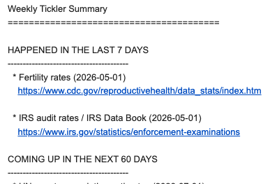

# Tickler file manager
A second brain for reminding you of dates important to you.

This script will email you a weekly rundown of recently past and upcoming entries in your tickler file.

If you don't have a tickler file, [this short post will get you started](https://joemurph.com/article/detail/tickler-files-for-journalists/).

Your tickler file can be a Google Sheet or a local CSV. I recommend getting a local CSV working first and then moving on to a Google Sheet, if desired.



Note that parts of this README and parts of the tickler.py code were written with AI. All code, except the Windows-specific code, has been tested by a human.

## What you'll need

1. A tickler sheet, in Google Sheets. OPTIONAL. You can use a local CSV instead.
2. A Google account (for sending emails to yourself).
3. A way to run computer jobs on a schedule.

## Setup

The hard stuff:

### 1a. Google Sheets API (OPTIONAL)
This is only necessary if your tickler file is a private Google Sheet.

1. In [Google Cloud Console](https://console.cloud.google.com), enable the **Google Sheets API** for your project.
2. Go to **APIs & Services → Credentials → Create Credentials → Service account**. Download the JSON key and save it locally (e.g. `service_account.json`).
3. Share your Google Sheet with the service account's email address (Viewer access is enough).

### 1b. Local CSV
Your CSV should have at minimum an `event` column and a `check-on` column (dates in `YYYY-MM-DD` format). Optional columns: `notes`, `related-url`, `is_quarterly`.

### 2. Gmail app password

In your Google Account, go to **[Security](https://myaccount.google.com/security) → 2-Step Verification → [App passwords](https://myaccount.google.com/apppasswords)** and generate a password for this script.

### 3. Config

Copy the example .env file:
```bash
cp .env.example .env
```

Fill in `.env`:

| Variable | Description |
|---|---|
| `SHEET_ID` | The long ID from your sheet's URL (optional) |
| `SERVICE_ACCOUNT_FILE` | Absolute path to the service account JSON (optional) |
| `GMAIL_USER` | Your Gmail address |
| `GMAIL_APP_PASSWORD` | The app password from step 2 |
| `EMAIL_TO` | Recipient address (defaults to `GMAIL_USER`) |

### 4. Install dependencies

```bash
python -m venv .venv && source .venv/bin/activate
pip install -r requirements.txt
```

### 5. Schedule

Pick the method for your platform. All examples run the script every Monday at 7:00 AM.

#### macOS (launchd)

Create `~/Library/LaunchAgents/com.tickler.plist`:

```xml
<?xml version="1.0" encoding="UTF-8"?>
<!DOCTYPE plist PUBLIC "-//Apple//DTD PLIST 1.0//EN" "http://www.apple.com/DTDs/PropertyList-1.0.dtd">
<plist version="1.0">
<dict>
    <key>Label</key>
    <string>com.tickler</string>
    <key>ProgramArguments</key>
    <array>
        <string>/path/to/tickler-file/.venv/bin/python</string>
        <string>/path/to/tickler-file/tickler.py</string>
    </array>
    <key>WorkingDirectory</key>
    <string>/path/to/tickler-file</string>
    <key>StartCalendarInterval</key>
    <dict>
        <key>Weekday</key>
        <integer>1</integer>
        <key>Hour</key>
        <integer>7</integer>
        <key>Minute</key>
        <integer>0</integer>
    </dict>
    <key>StandardOutPath</key>
    <string>/path/to/tickler-file/tickler.log</string>
    <key>StandardErrorPath</key>
    <string>/path/to/tickler-file/tickler.log</string>
</dict>
</plist>
```

Then load it:

```bash
launchctl load ~/Library/LaunchAgents/com.tickler.plist
```

#### Linux (cron)
This approach also works on Macintosh.

Run `crontab -e` and add:

```
0 7 * * 1 cd /path/to/tickler-file && .venv/bin/python tickler.py >> tickler.log 2>&1
```

#### Windows (Task Scheduler)

```bat
schtasks /create /tn "Tickler" /tr "C:\path\to\tickler-file\.venv\Scripts\python.exe C:\path\to\tickler-file\tickler.py" /sc weekly /d MON /st 07:00
```

## Usage

Preview the email without sending:

```bash
python tickler.py --dry-run
```

Send immediately:

```bash
python tickler.py
```

Run doctests:

```bash
python tickler.py --test
```

Verbose logging:

```bash
python tickler.py --verbose --dry-run
```

Override sheet or credentials without editing `.env`:

```bash
python tickler.py --sheet-id YOUR_ID --service-account-file /path/to/creds.json --dry-run
```

### Using a local CSV

Pass `--csv` to read from a local file instead of Google Sheets. The `SHEET_ID` and `SERVICE_ACCOUNT_FILE` env vars are not required in this mode.

```bash
python tickler.py --csv /path/to/tickler.csv --dry-run
```

Your CSV should have at minimum an `event` column and a `check-on` column (dates in `YYYY-MM-DD` format). Optional columns: `notes`, `related-url`, `is_quarterly`.

Logs from the scheduled run are written to `tickler.log`.
